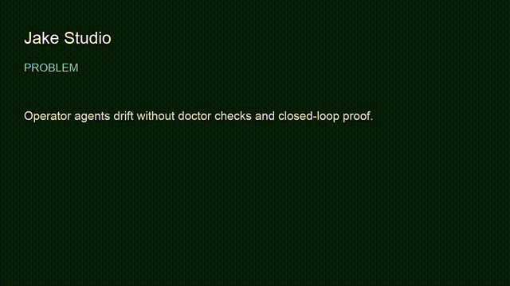

# jake-studio

> Local-first operator layer that routes work across people, models, tools, and verification gates — with the L10 self-evolving harness as the cognition / certainty substrate.
**Outcome:** `python3 -m compileall` smoke verifies 4 L10 harness modules offline, with the Builder/Verifier loop capped at max 3 feedback iterations.


## Employer summary

Jake is how an FDE runs governed agent work on a real workstation.

Not “one chat to rule them all.” A routing surface that:

- loads the right context and doctrine  
- splits Builder from Verifier (separate purpose, separate trust)  
- runs certainty / scenario checks (L10)  
- refuses completion without proof  

If proof-studio is the seal, **jake-studio is the operating loop that earns the seal**.

### Review path

1. This README  
2. Architecture diagram below  
3. [`packages/l10/`](packages/l10/) — harness modules + tests  
4. [`examples/closed-loop-builder-verifier/`](examples/closed-loop-builder-verifier/)  
5. [`docs/public-boundary.md`](docs/public-boundary.md)  

## Proof in 60 seconds

```bash
git clone https://github.com/mrodgersjs-web/jake-studio.git
cd jake-studio/packages/l10

# bytecode compile smoke (offline, no network)
python3 -m compileall -q src || python3 -m compileall -q .

# if console scripts are installed from this tree:
#   rig-l10-test
#   rig-l10 doctor
#   rig-l10-scenarios
```

Expected: modules present under `src/` (`certainty_engine`, `cognition_stack`, `nocturne`, `agent_factory` / chassis), tests referenceable, no cloud required for core smoke.

## Architecture

```text
Human goal
   │
   ▼
Jake operator routing
 (context · model · tools · doctrine)
   │
   ├─► Builder  (implements)
   │      │
   │      ▼
   └─► Verifier (read-only re-check)
              │ fail → feedback (max 3) → escalate
              ▼
         L10 certainty / scenarios
              │
              ▼
         ProofPacket / gate receipt
```

**Law:** never combine Builder and Verifier into one agent, one prompt, one context.

## Packages

| Path | Role |
| --- | --- |
| [`packages/l10`](packages/l10/) | L10 harness — certainty, cognition, nocturne, agent factory / chassis |
| [`packages/operator`](packages/operator/) | Public operator loader scripts (TAC doctrine helpers) |
| [`docs/operator`](docs/operator/) | Operator overview notes |
| [`examples/closed-loop-builder-verifier`](examples/closed-loop-builder-verifier/) | Closed-loop pattern |

### L10 module map (public)

| Module | Job |
| --- | --- |
| `certainty_engine` | Property-based / refute / lean-style certainty machinery |
| `cognition_stack` | Taste, council, adherence, strategy helpers |
| `nocturne` | Nightly improvement daemon patterns |
| chassis / agent factory | Deterministic agent stamp + packet store patterns |

## Evaluation / gates

| Gate | Intent |
| --- | --- |
| `python3 -m compileall` on `packages/l10` | import/syntax smoke |
| L10 unit/scenario suite (when installed) | harness behavior |
| Closed-loop max-3 | prevent infinite self-approval |
| Public boundary + flag-gate | no secrets / PII in public tree |

## How an FDE uses this

1. Bound the job (goal, non-goals, risk tier)  
2. Route through operator doctrine — not freeform chat  
3. Builder produces the change  
4. Verifier re-checks with read-only tools  
5. L10 / tests / smoke produce evidence  
6. Seal with proof-studio / ProofPacket when the claim matters  

## Public boundary

Excluded from this public surface:

- private mission payloads and personal ops  
- GTM / prospect senders  
- cookies, Keychain secrets, client monorepos  
- family / minor operating systems  

See [`docs/public-boundary.md`](docs/public-boundary.md).

## Video walkthrough

- Script: [`docs/video-script.md`](docs/video-script.md)  
- Shot list: false done → Builder/Verifier loop → L10 doctor → proof seal  

## Related studios

- [proof-studio](https://github.com/mrodgersjs-web/proof-studio) — seal and verify  
- [doctrine](https://github.com/mrodgersjs-web/doctrine) — rules loaded before action  
- [agency-studio](https://github.com/mrodgersjs-web/agency-studio) — role contracts  
- [fde-portfolio](https://github.com/mrodgersjs-web/fde-portfolio) — engagement playbooks  
- [mesh-studio](https://github.com/mrodgersjs-web/mesh-studio) — fleet control plane  

## License

MIT for public studio docs/scripts unless a nested package states otherwise.


---


## Video walkthrough

- Script: [`docs/video-script.md`](docs/video-script.md)
- Recording: [`assets/demo.mp4`](assets/demo.mp4) (75s captioned)
- Preview: [`assets/demo.gif`](assets/demo.gif)



## FDE bar (this studio)

| Practice | Here |
| --- | --- |
| Employer summary | top of README |
| 60s / smoke proof | 
╭───────────────────────────────────────────╮
│  RIGForge  ·  Live Tamper-Detection Demo  │
╰───────────────────────────────────────────╯

╭─────────────────────────────── 1 · the claim ────────────────────────────────╮
│  An AI agent reports:  BUILD COMPLETE ✅                                     │
╰──────────────────────────────────────────────────────────────────────────────╯
╭────────────────── 2 · RIGForge seals a signed ProofPacket ───────────────────╮
│                                                                              │
│  packet sha256   fcedab8e9001c35d5354dd131a6aa4e955ed155f0c7212af7f3d108f0…  │
│  hmac signature  ed749d1a844d5788d875dfa47800b6a8db69a3965de41c42…           │
│  integrity       ✔ valid                                                     │
│  signature       ✔ valid                                                     │
│                                                                              │
╰──────────────────────────────────────────────────────────────────────────────╯
╭─────────────────────────────── 3 · the tamper ───────────────────────────────╮
│                                                                              │
│  But did the agent tell the truth?                                           │
│                                                                              │
│  The artifact is TAMPERED and the packet hash is re-forged to hide it.       │
│  Naive integrity now PASSES — the lie looks clean.                           │
│                                                                              │
╰──────────────────────────────────────────────────────────────────────────────╯
╭──────────────────────────── 4 · RIGForge verify ─────────────────────────────╮
│                                                                              │
│  naive integrity check  PASS  — fooled by the re-forged hash                 │
│  hmac signature check   FAIL  — signature does not verify                    │
│                                                                              │
╰──────────────────────────────────────────────────────────────────────────────╯
╭───────────────────────────────────────────────────╮
│   🚨 FORGED. Signature invalid. The agent lied.   │
╰───────────────────────────────────────────────────╯

                Don't trust your agents. Prove them.  — RIGForge                

proof-studio smoke PASS |
| Public boundary |  |
| Claim under test | '"L10 core tests + doctor pass"' |
| Related fleet | [profile](https://github.com/mrodgersjs-web) · [resume](https://github.com/mrodgersjs-web/resume) · [patents teaser](https://github.com/mrodgersjs-web/patents) |

If 
╭───────────────────────────────────────────╮
│  RIGForge  ·  Live Tamper-Detection Demo  │
╰───────────────────────────────────────────╯

╭─────────────────────────────── 1 · the claim ────────────────────────────────╮
│  An AI agent reports:  BUILD COMPLETE ✅                                     │
╰──────────────────────────────────────────────────────────────────────────────╯
╭────────────────── 2 · RIGForge seals a signed ProofPacket ───────────────────╮
│                                                                              │
│  packet sha256   4d8e70f127f61b74b9ab9862ab44e878bea04cf78d84cc13379f57879…  │
│  hmac signature  8320f24e5620dd252d6ef60c158d183f312a44170819f9ee…           │
│  integrity       ✔ valid                                                     │
│  signature       ✔ valid                                                     │
│                                                                              │
╰──────────────────────────────────────────────────────────────────────────────╯
╭─────────────────────────────── 3 · the tamper ───────────────────────────────╮
│                                                                              │
│  But did the agent tell the truth?                                           │
│                                                                              │
│  The artifact is TAMPERED and the packet hash is re-forged to hide it.       │
│  Naive integrity now PASSES — the lie looks clean.                           │
│                                                                              │
╰──────────────────────────────────────────────────────────────────────────────╯
╭──────────────────────────── 4 · RIGForge verify ─────────────────────────────╮
│                                                                              │
│  naive integrity check  PASS  — fooled by the re-forged hash                 │
│  hmac signature check   FAIL  — signature does not verify                    │
│                                                                              │
╰──────────────────────────────────────────────────────────────────────────────╯
╭───────────────────────────────────────────────────╮
│   🚨 FORGED. Signature invalid. The agent lied.   │
╰───────────────────────────────────────────────────╯

                Don't trust your agents. Prove them.  — RIGForge                

proof-studio smoke PASS fails, the README claim is considered false until fixed.
